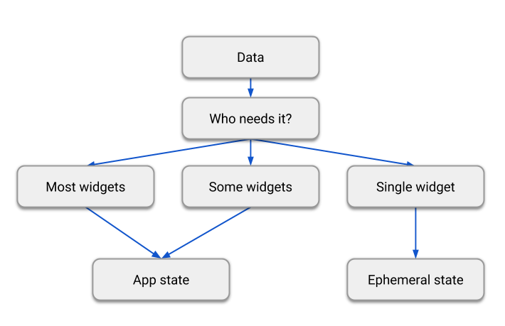

# State managment


플러터는 선언적이기 때문에, 앱에 현재 상태가 반영되도록 UI를 빌드한다.

유저가 셋팅 화면에서 스위치를 전환하는 경우 등 앱의 상태가 변하면,  당신이 상태를 변화시키고, 그것은 UI를 다시 그리도록 하는 트리거가 된다. 여기에는 UI 스스로 강제 변화하는 것이 없고, 당신이 상태를 변화시키면 UI가 scratch로 부터 다시 빌드된다.

선언적 스타일의 UI 프로그래밍은 많은 이점이 있다. 놀랍게도, UI에 대한 상태 코드는 오직 하나만 있다. 당신은 UI가 주어지는 상태에 대해 어떻게 생겨야하는지 한 번만 설명하면 된다. 그게 전부다.

처음에는 선언적 스타일이 직관적이지 않아 보일 수 있다.

## **Differentiate between ephemeral state and app state**

임시적인 상태와 앱 상태 구별하기

- 넓은 의미의 앱의 상태 : 앱이 실행 될 때 메모리에 존재하는 모든 것
    - 앱의 asstes, UI에 대해 플러터가 가지고 있어야 하는 모든 변수들, 애니매이션 상태, 텍스쳐, 폰트 등등
    - 근데 넓은 의미의 앱 상태 정의는 별로 의미가 없음. 왜냐?
        - 개발자가 직접 상태나 텍스쳐를 관리하지 않고 플러터가 해줌.
        - “언제든지 UI를 재구축 하는데 필요한 모든 데이터“ 라는 정의가 더 유의미하다.
        - 개발자가 직접 관리하는 상태는 개념적 유형으로 두가지로 나뉜다.
            1. 일시적 상태 2. 앱 상태
        

## 일시적인 상태

- UI 상태 또는 로컬 상태 라고도 함
- 한 개의 위젯에 대해 깔끔하게 들어있는 상태
예를 들어,
    - 페이지뷰의 현재 페이지
    - 복잡한 애니메이션의 현재 프로세스
    - 바텀 네비게이션 바의 현재 선택된 탭
- 위젯 트리의 다른 부분은 이런 종류의 상태에 접근할 필요가 거의 없다. 직렬화 할 필요가 없으며 복잡한 방식으로 변경되지 않는다. ScopedModel, Redux 같은 상태 관리 기술을 사용 할 필요가 없고, StatefulWidget만 있으면 된다.
    
    ```dart
    class MyHomepage extends StatefulWidget {
      const MyHomepage({super.key});
    
      @override
      State<MyHomepage> createState() => _MyHomepageState();
    }
    
    class _MyHomepageState extends State<MyHomepage> {
      int _index = 0;
    
      @override
      Widget build(BuildContext context) {
        return BottomNavigationBar(
          currentIndex: _index,
          onTap: (newIndex) {
            setState(() {
              _index = newIndex;
            });
          },
          // ... items ...
        );
      }
    }
    ```
    
    위 예제에서는 _index가 일시적인 상태임.
    
    앱의 다른 곳에서는 _index에 엑세스 할 필요가 전혀 없으며 오직 MyHomePage 위젯 안에서만 변경된다. 만약 앱을 재실행하거나 닫아서 _index가 0이 된다해도 신경 쓸 필요가 전혀 없다.
    

## App state

- 앱의 여러 부분에서 공유하며 사용자 세션 간 유지하고자 하는 상태를 애플리케이션 상태(공유상태) 라고 함.
- 일시적이지 않은 상태임.
    
    예를 들면,
    
    - 사용자 환경설정
    - 로그인 정보
    - SNS 앱의 알림
    - 쇼핑몰 앱의 장바구니
    - 뉴스앱의 기사 읽음 여부
- 앱 상태 관리를 선택함에 있어서 앱의 복잡도나 성격, 팀의 경험 등 많은 측면들에 따라 선택지가 달라질 수 있다.

## There is no clear-cut rule

— 명확한 규칙은 없다

- 정확히는, State와 setState()를 사용해서 앱의 모든 상태를 관리할 수 있다.
    - 실제로 플러터 팀은 많은 간단한 앱 샘플들에 이렇게 사용하고 있음
- 다른 방향으로 진행 할 수 도 있는데, 예를 들면 특정 앱에서 바텀 네비게이션의 선택된 탭을 임시 상태가 아닌 것으로 결정 할 수 있다. 그러면 클래스 외부에서 변경하거나 세션간 유지를 해야 할 수도 있는데, 이럴 경우 _index 변수는 앱 상태가 된다.
- 특정 변수가 임시상태 또는 앱 상태인지 구별하는 명확하고 보편적인 룰은 없다. 어쩔땐 하나를 다른 것으로 리팩토링 해야 할 수도 있다. 예를 들면, 명확하게 임시상태로 시작했어도 앱의 기능이 커짐에 따라 앱 상태로 변경되어야 할 수도 있다.
- 그런 이유로 아래 그림을 보자.



- 리덕스를 만든 단 아브라모브에게 리액트의 setState에 대해 물었더니 이렇게 대답햇다.
→ 기본 원칙 : 덜 어색한걸 해라

[요약]

플러터 앱에는 두가지 타입의 상태가 있다. 임시상태는 State와 setState()를 사용해서 구현 할 수 있고, 주로 단일 위젯에 위치한다. 다른 하나는 앱 상태다.

두 타입들은 각각 자신들의 위치가 있고, 앱의 복잡도와 개발자의 선호도에 따라 나뉜다.

---

## Simple app state management

— 간단한 앱 상태 관리


- cart 의 state는 어디에 놔야 할까?

### 상태 끌어 올리기

- 플러터는 사용하는 위젯 위에 상태를 유지시키는게 합리적이다.
    
    왜냐? 플러터 같은 선언형 프레임워크에서는 UI를 바꾸고 싶으면 재빌드를 해야만 한다.
    이런 것 MyCart.updateWith(somethingNew) 과 같은 쉬운 방법은 없다.
    다시 말해, 위젯의 외부에서 함수를 호출해서 위젯을 바꾸기가 어렵다는 말이다. 
    그리고 그렇게 하려면 프레임 워크랑 씨름해야 할 것임.
    
    아래와 같이 처리한다 하더라도
    
    ```dart
    // BAD: DO NOT DO THIS
    void myTapHandler() {
      var cartWidget = somehowGetMyCartWidget();
      cartWidget.updateWith(item);
    }
    ```
    
    MyCart 위젯에서 이걸 처리해야 한다
    
    ```dart
    // BAD: DO NOT DO THIS
    Widget build(BuildContext context) {
      return SomeWidget(
        // The initial state of the cart.
      );
    }
    
    void updateWith(Item item) {
      // Somehow you need to change the UI from here.
    }
    ```
    
    UI의 현재 상태를 고려하고 새로운 데이터를 적용해야한다. 버그가 안 날 수 가 없음.
    
    플러터에서는 컨텐츠가 바뀔 때 마다 매번 새 위젯을 만든다.
    `MyCart.updateWith(somethingNew)` (함수 호출) 대신 MyCart(contents)(생성자)를 사용해야한다.
    
    왜냐면 부모 위젯의 빌드 함수 안에서만 새 위젯을 만들 수 있기 때문에, 컨텐츠가 변하길 원한다면 새 위젯은 MyCart의 부모나 그보다 위쪽에 있어야 한다.
    
    ```dart
    // GOOD
    void myTapHandler(BuildContext context) {
      var cartModel = somehowGetMyCartModel(context);
      cartModel.add(item);
    }
    ```
    
    이제 MyCart는 다양한 버전의 UI를 만들기 위한 단 하나의 코드 경로 만을 가진다.
    
    ```dart
    // GOOD
    Widget build(BuildContext context) {
      var cartModel = somehowGetMyCartModel(context);
      return SomeWidget(
        // Just construct the UI once, using the current state of the cart.
        // ···
      );
    }
    ```
    
    이 예제에서, Contents는 MyApp 안에 존재해야한다. 언제든지 컨텐츠가 변하면 위에서 부터 MyCart를 다시 빌드한다. 따라서 MyCart는 라이프 사이클을 걱정할 필요가 없다. 그냥 컨텐츠가 전달해주는 것을 보여주기만 하면 된다. 바뀔 때, 예전 MyCart 위젯은 사라지고 새로운 것으로 완전히 대체된다.
    
    
    

위 이미지는 위젯이 불변하다는 것을 나타내는 것이다. 변하지 않고, 대체된다.

## **Accessing the state**

— 상태에 접근하기

유저가 카탈로그에서 아이템을 선택했을 때 장바구니에 담겨야한다. 하지만 카트가 MyListItem 상위에 있으므로 어떻게 해야 할까?

간단한 방법은 MyListItem이 클릭됐을 때 콜을 할 수 있도록 콜백을 만들어 주는 것이다.
다트의 함수들은 일급객체이기 때문에 함수를 원하는 곳 어디에나 전달 할 수 있다.
그래서, MyCatalog 내에서 다음과 같이 정의 할 수 있다.

```dart
@override
Widget build(BuildContext context) {
  return SomeWidget(
    // Construct the widget, passing it a reference to the method above.
    MyListItem(myTapCallback),
  );
}

void myTapCallback(Item item) {
  print('user tapped on $item');
}
```

---

## Options

https://fluttersamples.com/

- Provider
- RiverPod
- setState
- ValueNotifier & InheritedNotifier
- InheritedWidget & InheritedModel
- June
- Redux
- Fish-Redux
- BLoC / Rx
- GetIt
- MobX
- DartBoard
- Flutter Commands
- Binder
- GetX
- states_rebuilder
- Triple Pattern
- solidart
- flutter_reactive_value
- Elementary